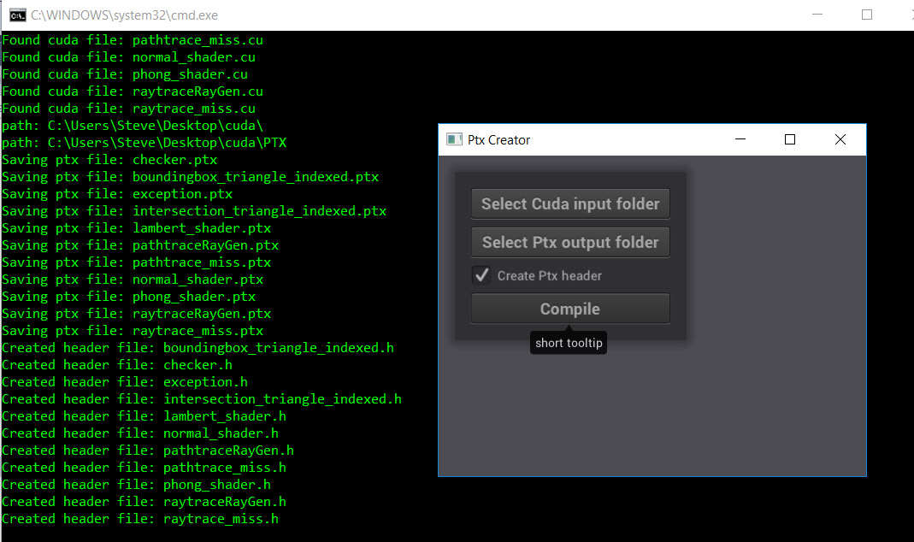

# PtxCreator

Windows only tool for compiling cuda source into ptx files and c++ headers for use with Optix

Build instructions for vs2015

1. clone this repository with the --recursive option to bring in the Nanogui submodule.

git clone --recursive https://github.com/Hurleyworks/PtxCreator.git

2. Within  the nanogui folder, create a folder named "build"
3. Run cmake, making the "build" folder the "where to build the binaries" folder
3. Compile the Nanogui solution with the default settings
4. Open the PtxCreator.sln in the PtxCreator/Builds/VisualStudio2015 folder and compile.

The build system assumes that you've installed Optix and Cuda in their default locations.
You'll need to change the "logFolder" path in NanoApp.cpp and the "defaultFolder" in NanoView.h to paths that work on your machine

If you use the "Create Ptx header" option, PtxCreator will generate a c++ header file with the Ptx source embedded in a string so your application doesn't need to load any ptx files from disk.

